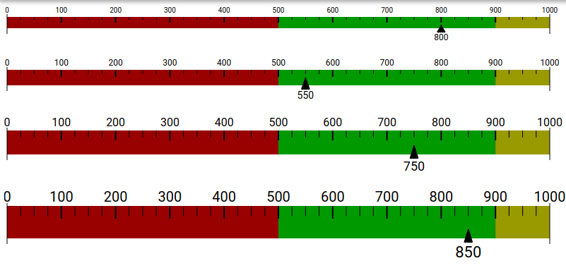

# linear-gauge

> A simple component.




## Installation

```
$ npm install --save linear-gauge
```

## Usage

```vue
<template>
  <linear-gauge :ranges="ranges" :width="800" :height="80" :divs="10" :subdivs="4" :value="750" :font="16" />
</template>

<script>
  import LinearGauge from 'linear-gauge';
  
  export default {
    data: () => ({
      data: {
            ranges:[ 
                {background:'#990000', min:0, max:1000}, 
                {background:'#009900', min:500, max:900},
                {background:'#999900', min:900, max:1000} 
            ],
            val:750,
      }
    }),
  };
</script>

